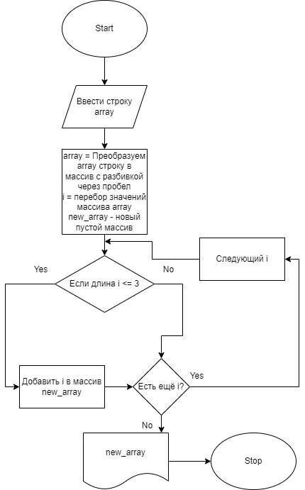

#Итоговая проверочная работа

_Задача:_
Написать программу, которая из имеющегося массива строк формирует массив из строк, 
длина которых меньше либо равна 3 символа. Первоначальный массив можно ввести с 
клавиатуры, либо задать на старте выполнения алгоритма. При решении не рекомендуется
пользоваться коллекциями, лучше обойтись исключительно массивами.

Алгоритм:
1. Запрос на ввод строки типа string.
2. Создаем массив array из элементов строки введеной выше с разбивкой через пробел.
3. В цикле перебираем элементы массива, если длина элемента массива менее или равна 3, добавляем данный элемент в новый массив new_array.
4. Выводим элементы полученного массива new_array.

Файлы:

**main.py - код программы на Python**

**block diagram/fw_bd.png - блок-схема**

